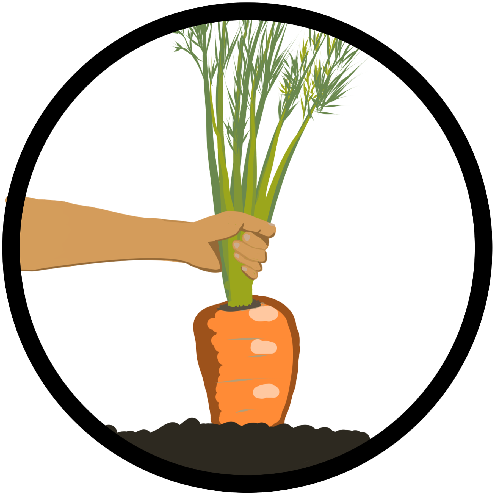

# Seasonal Pickings!

"Seasonal Pickings" is a web-application that aims to promote healthy eating habits and the use of locally-sourced food. Locally-sourced food supports local farmers, reduces carbon footprint, and provides more nutritious options for consumers. The app includes a game that challenges children to identify and locate seasonal produce for recipes, with real recipes provided for parents to use. It also showcases local sellers of locally sourced food, making it easier for families to make sustainable decisions. We believe the app has the potential to make a difference in promoting healthy eating habits and supporting local businesses

This is a screenshot from our web-application showing a selection of seasonal recipes which can be sourced locally. The web-app also can show you the steps and a full list of ingredients to make a selection of seasonal recipes. These recipes can also be reviewed on the web-app and you can see other peoples' ratings and reviews of dishes that you are wanting to try!

This screenshot shows the game, aimed towards educating children about locally sourcing healthy and declicious foods, being played in our web-app. The aim of the game is to explore the local area, venturing to different farms and markets to source the ingredients for a recipe of your choosing!

## How to run
1. Clone or download this repository
2. Open the repository in a code editor
3. Install all the dependencies using "npm i"
4. Start the project using "npm start"
5. Start the back-end server by using command ""npx json-server --watch data/db.json --port 8000""
6. Enjoy the app!
